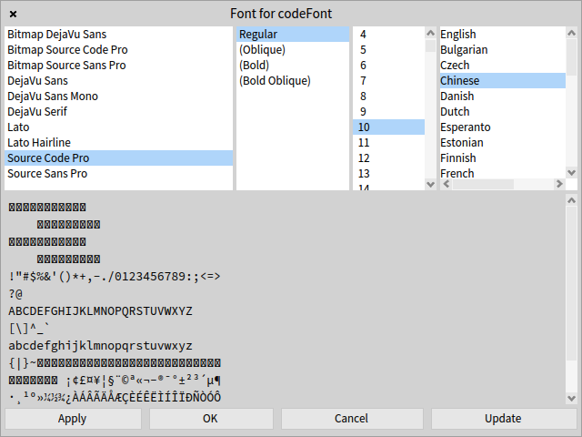
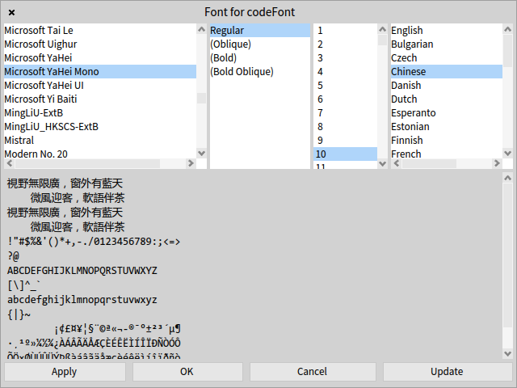

# Using CJK (Chinese, Japanese, and Korean) characters

Pharo's default font settings for code (Source Code Pro) and UI (Source Sans Pro) are unable to handle [CJK characters](https://en.wikipedia.org/wiki/CJK_characters), this page explains how to display them properly in Pharo.



Operating systems may come with fonts that support those characters but they are usually not monospaced which is not good for displaying code. If one need to display CJK characters in Pharo, it is recommended to install a monospace font which also covers CJK characters. Some of them are [`Noto Sans Mono CJK`](https://www.google.com/get/noto/) , `Microsoft YaHei Mono`, [`WenQuanYi Zen Hei Mono`](http://wenq.org).



Note that on Windows 10, one may need to manually copy font files to `C:\Windows\Fonts\`.

Here is a code sample:

```Smalltalk
StandardFonts 
	defaultFont: (LogicalFont familyName: 'Noto Sans CJK SC' pointSize: 9);
	codeFont: (LogicalFont familyName: 'Microsoft YaHei Mono' pointSize: 10);
	listFont: (LogicalFont familyName: 'Noto Sans CJK SC' pointSize: 9);
	menuFont: (LogicalFont familyName: 'Noto Sans CJK SC' pointSize: 9);
	buttonFont: (LogicalFont familyName: 'Noto Sans CJK SC' pointSize: 9);
	windowTitleFont: (LogicalFont familyName: 'Noto Sans CJK SC' pointSize: 10);
	balloonFont: (LogicalFont familyName: 'Noto Sans CJK SC' pointSize: 8);
	haloFont: (LogicalFont familyName: 'Noto Sans CJK SC' pointSize: 8).
```

## Related links:

https://www.samadhiweb.com/blog/2019.02.22.windows.multilingual.html  
http://forum.world.st/Japanese-Fonts-td4928056.html  
http://forum.world.st/im-using-pharo-7-with-linux-env-but-cannot-input-korean-td5095342.html
